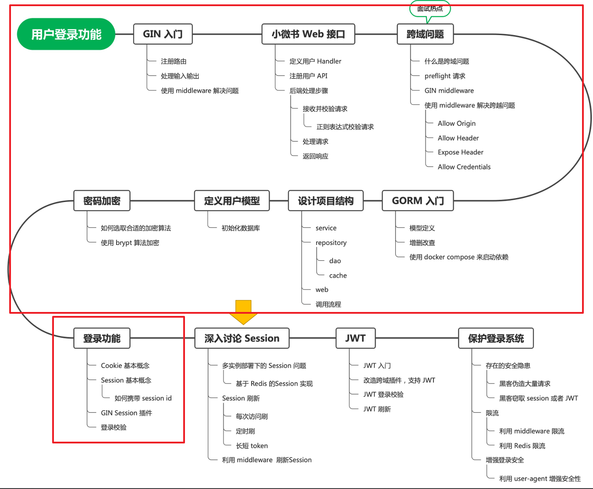
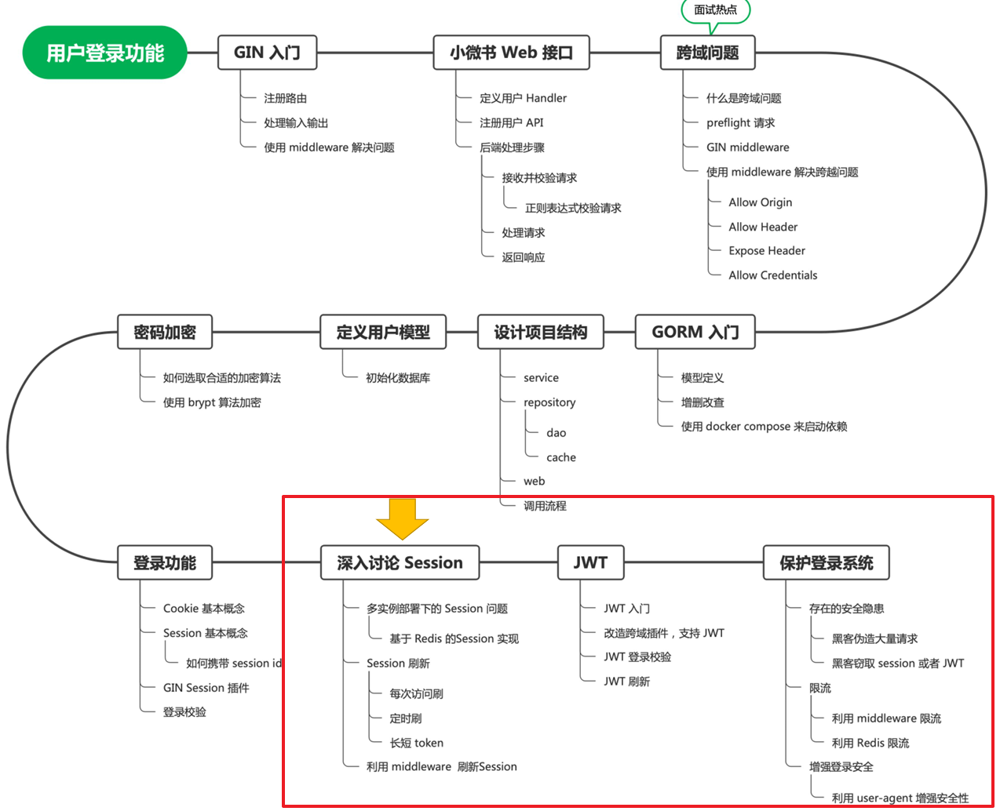
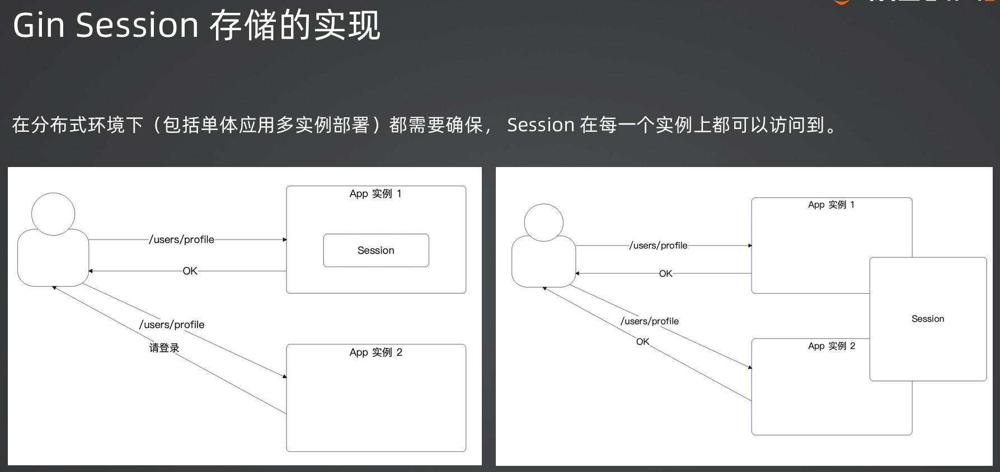

### week2重构与复习
（0） 学习内容：

（1）遇到的问题与解决：
1. internal包实现包的私有化：refactor-webook/webook/internal里面的代码只能被直接父包及其子包引用。所以refactor-webook/webook以外的地方调用不了internal里的内容（如refactor-webook/main.go），但refactor-webook/webook/main.go可以

（2）处理方式：
1. sign中遇到的email（unique）冲突问题是在dao层获取mysql错误码解决的。但在login中遇到的email不存在问题，可以直接在dao层声明gorm.ErrRecordNotFound的变量
2. 区分ssid与userId及其中用到的cookie和session：
   1) 在初始化web服务器时，需要初始化session，所以创建了基于cookie存储实现的session【即userId会被存进cookie中。注意：ssid是一定会被存在cookie中的，不管session是以什么方式实现的存储（如memcached、memstore等）】
   2) 基于步骤1的session，才能进行登录后的session.Set和登录校验的session.Get的userId
3) sessionId可以存放在哪里？
   1) cookie
   2) header（当cookie被禁用时）
   3) 查询参数（当cookie被禁用时）

### week3重构与复习
（0） 学习内容：

（1）处理方式：
1. gin Session 提供了很多session存储的实现方式，week2实现的是用cookie实现的session（即代码中的NewStore）
2. Gin Session存储的实现：多实例部署下一般选择redis，单实例部署选择memstore，再不行就用数据库（多实例部署：这套代码部署在几个机器上）
3. 要确保在分布式环境（包括单体应用的多实例部署）session在每个实例上都要访问的到

4. 刷新session的过期时间，后面还会用长短token实现
5. JWT前端后的约定：
   1) 后端给前端的JWT放在了Header中，key='x-jwt-token'
   2) 希望前端在请求的Authorization头部带上Bear token
6. JWT在后面退出登录的用法：
   1) JWT存储userId，用userId组成类似user.info:123的key，再用这个key去redis中取敏感信息

（2）待办：
1. 限流：利用rua脚本实现基于redis的对登录和注册的限流

### week4重构与复习 （记得新建branch）

